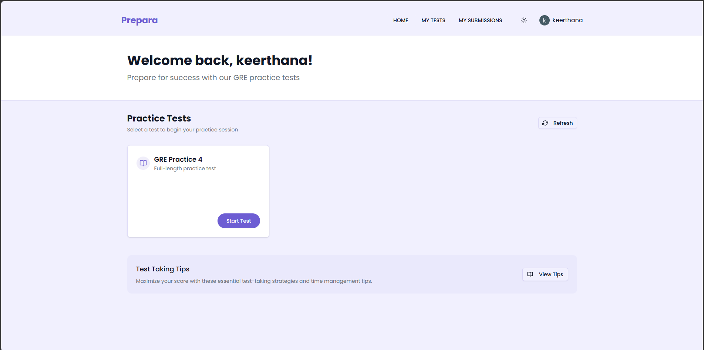

# Prepara

**Prepara** is a comprehensive online digital practice test platform designed to help students prepare for various exams. It provides a realistic testing environment, detailed analytics, and progress tracking to ensure success.





## Tech Stack

### Frontend
- **React**
- **Tailwind CSS**
- **Radix UI / Shadcn UI**
- **Clerk**

### Backend
- **Node.js**
- **Express**
- **MongoDB**
- **Mongoose**
- **Cloudinary**

## Features

- **Realistic Test Environment**: Simulates the actual GRE exam interface and timing.
- **Progress Tracking**: Detailed analytics on performance, strengths, and weaknesses.
- **User Authentication**: Secure login and signup for students and admins via Clerk.
- **Admin Dashboard**: Manage students, create and edit tests, and view platform statistics.
- **Test Management**: Create, update, and delete practice tests efficiently.
- **Result Analysis**: Instant scoring and feedback on completed tests.
- **Resume Capability**: Save progress and resume tests at any time without losing data.

## Local Installation & Setup

Follow these steps to install and run the project locally.

### Prerequisites

- [Node.js](https://nodejs.org/) installed on your machine.
- A running instance of MongoDB (local or Atlas URI).
- A [Clerk](https://clerk.dev/) account for authentication.

### 1. Clone the repository

```bash
git clone <repository-url>
cd testsat
```

### 2. Backend Setup

Navigate to the backend directory, install dependencies, and set up your environment variables:

```bash
cd backend
npm install
```

Copy the example environment file:
```bash
cp .env.example .env
```
> **Note:** Open `backend/.env` and fill in your actual values (e.g., `MONGO_URI`, `CLERK_SECRET_KEY`, etc.).

Start the backend development server:
```bash
npm run dev
```

### 3. Frontend Setup

Open a new terminal window/tab and navigate to the frontend directory:

```bash
cd frontend
npm install
```

Copy the example environment file:
```bash
cp .env.example .env
```
> **Note:** Open `frontend/.env` and update it with the necessary variables (e.g., `VITE_CLERK_PUBLISHABLE_KEY`, backend URL).

Start the frontend development server:
```bash
npm run dev
```

The application should now be accessible in your browser (usually `http://localhost:5173`).

On mobile browsers go to https://prepara.bksh.site/?eruda=true || http://localhost:5173/?eruda=true for dev tools
